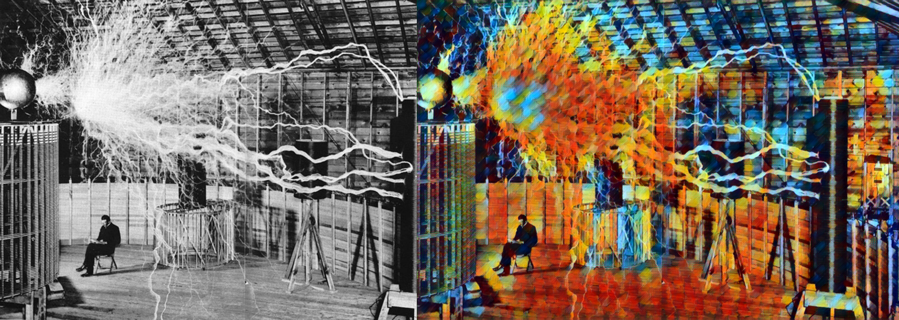

 

Based off of fast_neural_style example at https://github.com/pytorch/examples

To run use the following commands in console while in main directory:

pip install -r requirements.txt

streamlit run streamlit_main.py 

Best if hosted on local system. Install pytorch from here: https://pytorch.org/ Make sure to use a download that fits your local system, ie if you have CUDA 10.1 you should choose that version. Due to the hardware requirements I also made an accompanying google colab notebook. Running on colab requires ngrok, which introduces compute limits and other errors, so the colab implementation is more for accesibility than professional use.  

Works with the current versions (Feb. 24th 2021) of pytorch and streamlit, so if you have these then you might be able to run locally without a venv.

### Colab Notebook
All the code is included in the google colab notebook pytorchNeuralStyle.ipynb

This notebook is more accessible for a No/Low code implementation, as user only needs to run the cells in colab. But be aware that ngrok - which we use to host the streamlit app from colab - can be finnicky. Once you have the streamlit app up go to the ngrok.io link. 

If you just want to run the style transfer algorithm without streamlit, simply run the 'Pytorch Neural Style Transfer Example From Source' section. Although with this option you need to upload your own image manually and specify your model under the --model argparse option (directions in notebook)  

### Notes
/saved_models/ directory contains capitalized duplicates. Not necessary to run it locally but is necessary in our more google colab notebook pytorchNeuralStyle.ipynb (reall shouldn't be necessary but apparently it is when using ngrok) 

You can eve use it on photos of your dog!

